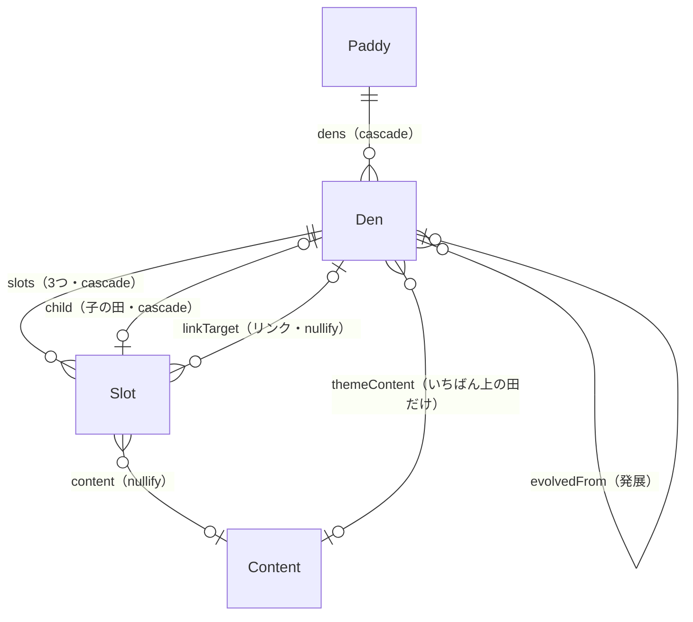

# NewDen データモデル

concept.md の決定事項を、SwiftData のモデルに落とし込んだ設計。

- ステータス: 設計（未実装）
- 最終更新: 2026-09-25
- 前提: SwiftData を使い、iCloud（CloudKit）で同期する

---

## 1. 全体像

エンティティは4つ。田園（ネットワーク全体）は保存せず、リンクをたどって求める。

| エンティティ | 用語 | 役割 |
|---|---|---|
| `Paddy` | 田んぼ | 子の関係でつながった田のツリー（最大4階層） |
| `Den` | 田 | 主題1つと要素のマス3つ |
| `Slot` | マス（要素） | 要素のマス。子の田、またはリンクを1つだけ持てる |
| `Content` | 内容 | マスに書かれたテキスト。参照型の共有のため独立させる |



### 主題の持ち方

主題のマスは `Slot` として持たない。

- **子の田の主題** ＝ 親の田の要素のマス（`parentSlot`）の内容。同じものを2回保存しない。
- **いちばん上の田の主題** ＝ `themeContent` に持つ。

こうすると「子の田の主題を直すと、親の田の要素も変わる」ことが、仕組みとして必ず成り立つ。

> モックでは子の田の主題と親の要素が同じテキストIDを共有していたため、参照の数え方で除外する処理が必要だった。この設計ではその処理が不要になる。

---

## 2. エンティティ

CloudKit 同期の制約（ユニーク制約を使えない、関係はすべてオプショナル、属性はすべて既定値を持つ）に合わせて書く。

```swift
import SwiftData
import Foundation

/// 田の型。初期バージョンでは6種類に固定する。
enum DenKind: String, Codable, CaseIterable {
    case goal            // 目標
    case event           // 出来事
    case feeling         // 感情
    case question        // 問い
    case dilemma         // 迷い
    case threeGoodThings // Three Good Things
}

/// 田んぼ：子の関係でつながった田のツリー。
@Model final class Paddy {
    var id: UUID = UUID()
    var createdAt: Date = Date.now
    var updatedAt: Date = Date.now

    @Relationship(deleteRule: .cascade, inverse: \Den.paddy)
    var dens: [Den]? = []
}

/// 田：主題1つと要素のマス3つ。
@Model final class Den {
    var id: UUID = UUID()
    var kindRaw: String = DenKind.goal.rawValue
    var createdAt: Date = Date.now
    var updatedAt: Date = Date.now

    var paddy: Paddy?

    /// 親の田の要素のマス。nil ならいちばん上の田。
    var parentSlot: Slot?

    /// いちばん上の田の主題。子の田では常に nil。
    var themeContent: Content?

    @Relationship(deleteRule: .cascade, inverse: \Slot.owner)
    var slots: [Slot]? = []

    /// この田を指しているリンク（バックリンク）。
    @Relationship(deleteRule: .nullify, inverse: \Slot.linkTarget)
    var incomingLinks: [Slot]? = []

    /// 発展元の田。
    var evolvedFrom: Den?
    @Relationship(deleteRule: .nullify, inverse: \Den.evolvedFrom)
    var evolvedInto: [Den]? = []
}

/// 要素のマス。
@Model final class Slot {
    var id: UUID = UUID()
    /// 1〜3（右上・左下・右下）。SwiftData の配列は順序を持たないため位置を保存する。
    var position: Int = 1

    var owner: Den?

    /// nil は空欄。
    var content: Content?

    /// 子の田。linkTarget とは同時に持たない。
    @Relationship(deleteRule: .cascade, inverse: \Den.parentSlot)
    var child: Den?

    /// ブランチなどで別の田んぼの田を指すリンク。child とは同時に持たない。
    var linkTarget: Den?
}

/// マスの内容。複数のマスから参照できる。
@Model final class Content {
    var id: UUID = UUID()
    var text: String = ""
    var createdAt: Date = Date.now
    var updatedAt: Date = Date.now

    @Relationship(deleteRule: .nullify, inverse: \Slot.content)
    var slots: [Slot]? = []

    @Relationship(deleteRule: .nullify, inverse: \Den.themeContent)
    var themedDens: [Den]? = []
}
```

### 型を文字列で持つ理由

`kindRaw` を `String` で保存し、`DenKind` は計算プロパティで返す。enum をそのまま保存すると、`#Predicate` で型を条件にした絞り込みがしにくいため。

---

## 3. 計算で求める値

保存せず、そのつど計算する値。1つの田んぼは田が最大40個なので、たどる量は小さい。

| 値 | 求め方 |
|---|---|
| 田の主題 | `parentSlot?.content ?? themeContent` |
| 階層（0〜3） | `parentSlot` を上にたどった回数 |
| 田んぼのいちばん上の田 | `paddy.dens` のうち `parentSlot == nil` のもの |
| 田んぼの名前 | いちばん上の田の主題 |
| 田んぼの深さ | 田んぼ内の田の階層の最大値 |
| 未完かどうか | 3つの要素のマスのどれかが空欄（`content` が nil か、テキストが空白だけ） |
| 参照されている数 | 下の「参照の数え方」 |
| バックリンク | `incomingLinks` |
| 田園 | `Slot.linkTarget` をたどってつながる田んぼの集まり |

### 参照の数え方

`Content` を使っている場所の数 ＝ `slots` の数 ＋ `themedDens` の数。ただし、ブランチでできた組は1か所として数える。

- ブランチを切ると、リンク元のマスとリンク先の田の主題が同じ `Content` を共有する。これは同じ考えのつながりなので、別々の場所には数えない。
- 数えた結果が2以上のとき、マスにバッジを表示する。

---

## 4. 守るべきルール（不変条件）

| # | ルール |
|---|---|
| 1 | 田は要素のマスを3つ（位置1〜3）ちょうど持つ |
| 2 | `parentSlot == nil`（いちばん上の田）なら `themeContent` を持つ。子の田なら持たない |
| 3 | 1つの田んぼに、いちばん上の田はちょうど1つ |
| 4 | マスは `child` と `linkTarget` を同時に持たない |
| 5 | 子の田は、親の田が完成していて、そのマスが空欄でないときだけ作れる |
| 6 | 階層は3（第4層）まで。第4層の田のマスは子を持てない（リンクだけ持てる） |
| 7 | 子の田は親の田と同じ田んぼに属する |
| 8 | 完成した田の型は変えない |
| 9 | リンクは別の田んぼの田を指す |

1〜7 と 9 はデータを変える操作（次の章）の中で守る。8 は型を変える操作の前提条件にする。

---

## 5. 操作

画面から直接モデルを書き換えず、操作をまとめた層（例：`DenStore`）を通す。前提条件が満たされないときは、操作ごとの理由を返して画面に表示する。

| 操作 | 前提条件 | 変更内容 |
|---|---|---|
| 田んぼを作る | なし | `Paddy`、いちばん上の田、主題、空欄のマス3つを作る。主題は空。ただし型が Three Good Things なら作成日を入れる（9章） |
| 書く | なし | マスが空欄なら `Content` を作る。あれば `text` を更新する |
| 型を変える | 田が未完 | `kindRaw` を更新する。いちばん上の田を Three Good Things に変え、主題が空なら作成日を入れる |
| 子の田を作る | ルール5。マスが子もリンクも持たない。階層が0〜2 | 同じ田んぼに田を作り、`parentSlot` をそのマスにする |
| ブランチを切る（下） | ルール5。マスが子もリンクも持たない。階層が3 | 新しい田んぼを作り、いちばん上の田の `themeContent` をマスの内容と共有する。マスの `linkTarget` をその田にする |
| 親の田を作る | いちばん上の田。田んぼの深さが0〜2 | 同じ田んぼに新しい田 P を作る。元の田の `themeContent` を P の位置1のマスに移し、元の田の `parentSlot` をそのマスにする |
| 親の田を作る（ブランチ） | いちばん上の田。田んぼの深さが3 | 新しい田んぼに田 P を作る。P の位置1のマスが元の田の主題を共有し、`linkTarget` で元の田を指す |
| 参照を貼る | マスが空欄。子もリンクも持たない | マスの `content` を、コピーした `Content` にする |
| この場所から外す | マスが子もリンクも持たない | マスの `content` を nil にする |
| 内容そのものを消す | 参照が2か所以上なら確認する | `Content` を削除する（使っていたマスは空欄になる） |
| 発展 | 田が完成している | 新しい田んぼを作り、そのいちばん上に新しい型の田を置く。主題は元の田の主題を**コピー**した新しい `Content`（共有しない）。`evolvedFrom` で元の田とつなぐ |
| 田を消す | なし | その田と、子孫の田をすべて消す。この田を指すリンクは外れる |

### 後片付け

どのマスからも、どの田の主題からも使われなくなった `Content` は削除する。削除の操作のあとに毎回行う。

### 発展の主題をコピーにする理由

発展は「考えが変わった」ことの記録なので、元の田はそのまま残したい。主題を共有すると、発展した田の主題を書き直したときに元の田の主題まで変わってしまう。そのため、発展の主題だけは共有せずコピーにする。

---

## 6. 削除のルール

| 関係 | ルール | 理由 |
|---|---|---|
| 田んぼ → 田 | cascade | 田んぼを消すと中の田も消える |
| 田 → マス | cascade | マスは田の一部 |
| マス → 子の田 | cascade | 子の田は親のマスに属する |
| マス → リンク先 | nullify | リンク先が消えても、リンク元のマスは普通のマスとして残る |
| マス → 内容 | nullify | 内容は共有されるので、マスを消しても内容は残す（後片付けで消す） |
| 田 → 発展元 | nullify | 発展元が消えても、発展した田は残す |

---

## 7. よく使う取得

| 画面 | 取得のしかた |
|---|---|
| 田んぼの一覧 | `Paddy` を `updatedAt` の新しい順 |
| 入れ子表示 | 田んぼの `dens` を読み、`parentSlot` と `position` で配置する |
| タイムライン表示 | `Den` を `createdAt` の新しい順 |
| バックリンク | `Den.incomingLinks` |

`Paddy.updatedAt` は、中の田やマスを変更したときに一緒に更新する（一覧の並び順に使うため）。

---

## 8. iCloud 同期で気をつけること

- **ユニーク制約を使えない**：`id` の重複はアプリ側で防ぐ。
- **関係はすべてオプショナル**：上のコードはすべて `?` にしている。
- **ルールが崩れることがある**：2台の端末で同時に同じマスへ子の田を作ると、同期後にどちらか一方の田が浮いてしまう。起動時と同期のあとに整合性チェックを行い、次のように直す。
  - どのマスにもつながらない子の田 → 新しい田んぼのいちばん上の田にする。
  - 要素のマスが3つでない田 → 足りないマスを作る。重複したマスは内容を残して1つにまとめる。
  - いちばん上の田が2つある田んぼ → 1つを別の田んぼに分ける。
- **スキーマの版を最初から管理する**：`VersionedSchema` と `SchemaMigrationPlan` を初版から用意して、後からの変更に備える。

---

## 9. Three Good Things の日付

- いちばん上の田を Three Good Things で作るとき、主題に**作成日を自動で入れる**。
- 形式は `2026年9月25日（金）`（`Date.FormatStyle` で年・月・日・曜日を日本語表記）。
- 入れるのは普通のテキストなので、あとから書き換えられる。
- 子の田を Three Good Things にした場合、主題は親の田の要素のマスなので、日付は入れない。

---

## 10. 元に戻す（Undo）

SwiftData の `UndoManager` 連携を使う。

### しくみ

- `ModelContainer` を作るときに Undo を有効にする（SwiftUI では `.modelContainer(for:isUndoEnabled: true)`）。
- 操作をまとめた層（`DenStore`）の**1つの操作を1回の Undo** にする。操作の最初と最後で `beginUndoGrouping()` と `endUndoGrouping()` を呼び、`setActionName(_:)` で操作名（例：「子の田を作る」）を付ける。
- 後片付け（使われなくなった `Content` の削除）も同じまとまりに含める。Undo すると内容も戻る。
- **書く**操作は1文字ごとではなく、マスの編集を始めてから終えるまでを1回にまとめる。

### Undo に含めないもの

- 起動時や同期のあとに行う**整合性チェックの修正**。`disableUndoRegistration()` で記録しない。ユーザーの操作ではないため。
- 同期で他の端末から届いた変更。

### 画面

- 田を消すなど取り消したくなりやすい操作のあとは、画面下に「元に戻す」ボタン付きの通知を数秒出す。
- 端末を振る操作（シェイクで取り消す）と、iPad のキーボードの ⌘Z にも対応する。
- Undo できるのは、アプリを起動している間だけ。終了すると履歴は消える。
- Undo があるので、田を消すときの確認ダイアログは出さない。ただし「内容そのものを消す」で参照が2か所以上あるときは、影響が大きいので確認する。

---

## 11. 未決事項

- なし（2026-09-25 時点）
